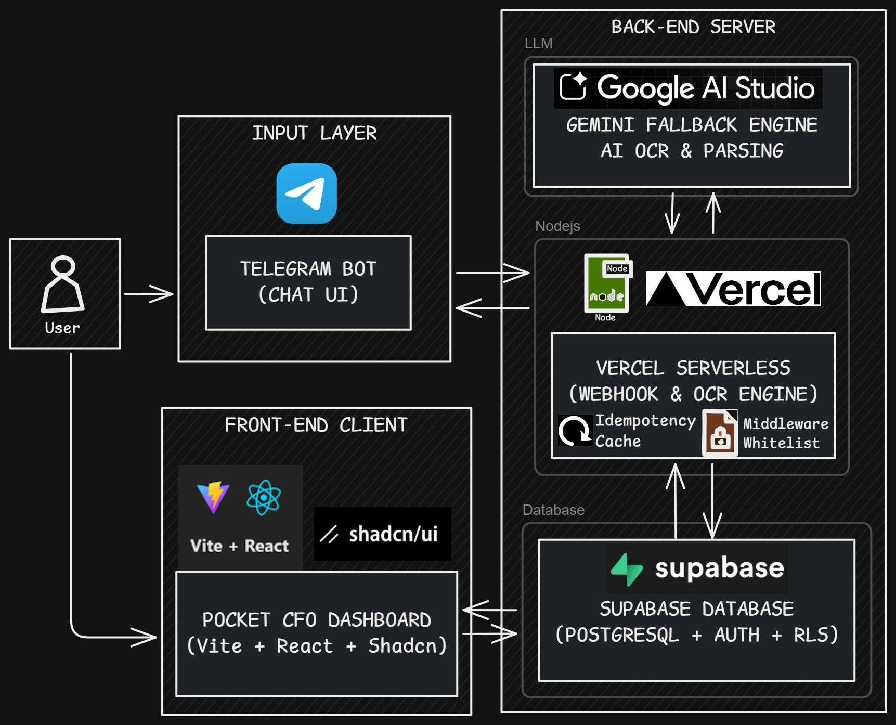

# Pocket CFO: AI-Powered Personal Finance Command Center


> *"In an era of rising inflation, managing cash flow effectively is no longer optional—it's a survival skill. Pocket CFO automates the friction of data entry, transforming raw receipts into actionable financial intelligence."*

**Pocket CFO** is a personal financial engine that bridges the gap between instant transaction logging and deep strategic analysis. By utilizing a **Telegram Bot** for frictionless input and **Gemini AI** for intelligent parsing, it offloads the mental burden of tracking money.

---

## Transforming Data into Insights
Pocket CFO goes beyond simple expense tracking by implementing treasury-grade financial concepts:

*   **Liquidity Tracking (Real Disposable Income):** Instantly see "Safe to Spend" cash after accounting for fixed costs and savings goals.
*   **Predictive Analytics:** The Burn Rate Predictor uses daily spending velocity to forecast end-of-month financial health.
*   **Automated Sinking Funds:** Manage progress toward long-term goals (Emergency Funds, Travel, Education) with built-in allocation logic.
*   **OCR-Powered Explorer:** Deep-dive into item-level data extracted from receipts to identify inflation or pricing anomalies.

---

## System Architecture

This monorepo showcases a decoupled, serverless architecture designed for high availability and zero cost.



---

## Quick Start & Exploration

### 1. Database Setup
1.  Initialize a project at [supabase.com](https://supabase.com).
2.  Run `supabase/schema.sql` in the SQL Editor to set up the tables, Row Level Security (RLS), and analytics views.
3.  **Explore with Sample Data (Optional):** To see the dashboard's visualization capabilities immediately, you can run the `supabase/seed.sql` script. 
    
    **Crucial Step Before Seeding:** > Our database enforces strict relational integrity and Telegram ID whitelisting. You must link the demo data to your actual accounts.
    > 
    > 1. **Get your Supabase UID:** Go to **Authentication -> Users** in your Supabase dashboard, create a new dummy user (e.g., `demo@test.com`), and copy the newly generated **User UID**.
    > 2. **Get your Telegram ID:** Open your Telegram app, search for the `@userinfobot` (or any similar ID bot), send `/start`, and copy the **numerical ID** it gives you.
    > 3. Open `supabase/seed.sql` in your editor and replace:
    >    * All instances of `00000000-0000-0000-0000-000000000000` with your **User UID**.
    >    * The dummy `telegram_id` (`123456789`) with your actual **Telegram ID**.
    > 4. Run the script in the Supabase SQL Editor.

### 2. Frontend Development

To run the frontend locally, you need to connect it to your Supabase project. You can find your API keys in your Supabase Dashboard by going to **Project Settings** (the gear icon) -> **API**.

* **`VITE_SUPABASE_URL`**: Found under the **Project URL** section.
* **`VITE_SUPABASE_PUBLISHABLE_DEFAULT_KEY`**: Found under the **Project API Keys** section (use the key labeled `anon` `public`).

```bash
cd frontend
pnpm install

# Create a .env file in the /frontend directory and add your credentials:
# VITE_SUPABASE_URL=https://abcdefghijklmnopq.supabase.co
# VITE_SUPABASE_PUBLISHABLE_DEFAULT_KEY=eyJhbGciOiJIUzI1NiIsIn...

pnpm dev
```

### 3. Telegram Bot (Serverless Backend)

To keep this project **100% free** and highly scalable, the backend avoids traditional 24/7 server polling. Instead, it utilizes a **Serverless Webhook** architecture. Since Telegram requires a public HTTPS URL to push message updates, we deploy this directly to Vercel.

#### Step A: Gather Your Keys (The Prerequisites)
Before deploying, collect your credentials from these three platforms:

1. **Telegram Bot Token:** Open Telegram, search for the `@BotFather` account, send the `/newbot` command, and follow the prompts to receive your HTTP API Token.
2. **Google AI Studio Key:** Visit [Google AI Studio](https://aistudio.google.com/) and generate a free API key. This is the OCR engine that parses your receipts.
3. **Supabase Service Key:** Go to your Supabase **Project Settings -> API**. Find the `service_role` `secret` key.
   > **Security Note:** Unlike the Frontend which uses the `anon` key, the Bot acts as an admin. It requires the `service_role` key to securely bypass Row Level Security (RLS) and insert incoming data directly into the database. Never expose this key to the client side.

#### Step B: Deploy to Vercel
1. Log in to [Vercel](https://vercel.com) and create a **New Project**.
2. Import your cloned repository.
3. **Important for Monorepos:** Set the **Root Directory** to `telegram-bot`.
4. Configure the **Build and Output Settings** exactly as follows to prevent Vercel from treating this backend as a static frontend app:
    * **Framework Preset:** `Other`
    * **Build Command:** *(Override and leave empty)*
    * **Output Directory:** *(Override and leave empty)*
    * **Install Command:** `pnpm install`
5. In the **Environment Variables** section, add the following:

```env
TELEGRAM_BOT_TOKEN=your_telegram_bot_token
GEMINI_API_KEY=your_gemini_api_key
SUPABASE_URL=https://abcdefghijklmnopq.supabase.co
SUPABASE_KEY=your_supabase_service_role_secret
WEBHOOK_SECRET=create_a_custom_random_string_here
```
*(Note: `WEBHOOK_SECRET` is a custom password you invent right now to prevent unauthorized POST requests to your Vercel endpoint).*

#### Step C: Connect Telegram to Vercel (Set Webhook)
Finally, you must tell Telegram where to send incoming chat messages and give it the secret password to bypass your backend's security layer. 

Open a new tab in your web browser and paste the following URL. Ensure you replace all the bracketed variables with your actual data:

`https://api.telegram.org/bot<YOUR_TELEGRAM_TOKEN>/setWebhook?url=https://<YOUR_VERCEL_DOMAIN>/api/webhook&secret_token=<YOUR_WEBHOOK_SECRET>`

*(Note: Telegram enforces strict rules for the `secret_token`. It must only contain alphanumeric characters, underscores, or dashes `[a-zA-Z0-9_-]` and exactly match the `WEBHOOK_SECRET` you saved in Vercel).*

If you see a JSON response saying `"ok": true` and `"description": "Webhook was set"`, congratulations! Your personal CFO is now live, secure, and waiting for your receipts.

#### Step D: Test Your AI CFO
Now that the webhook is active and secure, let's verify the end-to-end pipeline (Telegram > Vercel > Gemini > Supabase).

1. Open your newly created bot in the Telegram app and click **Start**.
2. **Test 1 (Natural Language Text):** Send a casual expense message. For example:
   > *"Beli kopi kenangan 25rb pakai qris, 22 April 2026"*
3. **Test 2 (Vision/OCR):** Snap a photo of a recent minimarket receipt or upload a screenshot of a digital payment (e.g., GoPay/OVO transfer receipt).
4. **The Result:** The bot should process the input via Gemini and reply with a structured summary. You can immediately check your Supabase `transactions` and `transaction_items` tables (or open your local Frontend dashboard) to see the magic happen!

---

## Architectural Decisions

* **Resilient AI Pipeline:** Implemented a robust multi-model fallback mechanism. The system intelligently cycles through **Gemini 3.1 Flash Lite**, **Gemini 3.0 Flash**, and **Gemini 2.5 Flash** models. This ensures the OCR engine remains responsive and maintains high availability even during API rate limits or regional downtime.
* **Database-Level Intelligence:** Shifted heavy financial aggregations (Burn Rate, Pacing) to **Postgres Views** using `security_invoker`. This minimizes frontend logic and ensures consistent metrics across different client interfaces.
* **Security & Isolation:** Implemented strict **Row Level Security (RLS)**, ensuring data is isolated at the database level and never leaked between users.
* **Localization Strategy:** Designed with a "Global UI, Local Data" approach—standard English interface with Indonesian-optimized data parsing (IDR formatting, local merchant recognition).

---

## Engineering Note

Pocket CFO was born out of a personal need to simplify financial discipline. The goal was to build a system that is low-friction for the user but high-value in its output. It is a testament to how AI can be integrated into daily workflows to make complex tasks like financial management more accessible and automated.